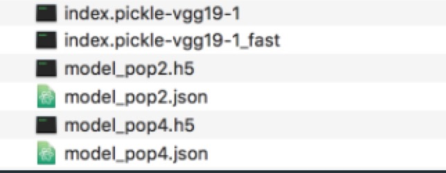

# Keras CNN Image Retrieval System

It is my bachelor capstone project. It uses the most popular deep learning algorithm CNN and related tech stacks Keras to build an image retrieval system. For better user experience, I integrate the system with a web application with Vue, Django and MongoDB.

### Screenshots

Overview


1. Query in database


2. Upload Query


3. Result


### Installation

1. Install dependencies.
  - npm install in client/
  - pip3 install -r requirements.txt in server/

And I recommend use conda to manage your python environments.

2. Download the datasets
 - download [Caltech101](http://www.vision.caltech.edu/Image_Datasets/Caltech101/)
 - change the folder name as database
 - move it to server/

3. Generate feature files and model files using model.ipynb
  - download [vgg16 and vgg19 kernals](https://github.com/fchollet/deep-learning-models/releases/tag/v0.1)
  - move it to model/
  - run the model.ipynb with different configrations(you need to read the code) and get all the 6 files above
  - run model/save.py based on 2 index file to create the database on mongodb
  - create a new folder server/h5File and move other 4 model files to server/h5File

  

### How to use?

1. make sure the database is running
2. server

```python
python manage.py runserver
```
3. client

```js
npm run dev
```

### Contribute

It might be the only period of time for me to do something with ML and DL. But it is fun. Hope this project is helpful to you. If you have any questions, feel free to contact me!

### Credits
- [Bianry Hash Code](https://www.iis.sinica.edu.tw/~kevinlin311.tw/cvprw15.pdf)
- [arpit512512](https://github.com/arpit512512/Deep-Learning-of-Binary-Hash-Codes-for-Faster-Image-Retrieval).

### License
MIT © [Tivcrmn](https://github.com/Tivcrmn)
